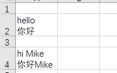
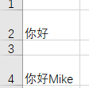
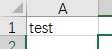
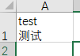

<!--
 * @Author: WangYuRan
 * @Date: 2021-01-02 21:21:28
 * @LastEditors: WangYuRan
 * @LastEditTime: 2021-01-14 15:17:05
 * @Description: 描述
 * @FilePath: \undefinedd:\pyPro\excel-common-operations\delete-cell-english\README.md
-->

graph TD;
    A-->B;
    A-->C;
    B-->D;
    C-->D;

# delete-cell-english

---
## 功能需求：
1.   删除输入文件中指定sheet页内的中英文混合单元格的英文。
2.   读取config中的中英文对照关系，若当前excel存在该对应关系则添
加翻译

---
## 流程

graph TD;
  start([开始])-->id1[读取config];
  id1-->id2[遍历文件夹];
  id2-->id3[读取输入文件信息];
  id3--功能一-->ac1[删除英文];
  id3--功能二-->ac2(根据历史纪录翻译英文);
  ac1-->End([结束]);
  ac2-->End([结束]);

---

## 使用方法

1. 按照自己的需求编辑config文件
2. 运行 MainPage.py 
3. 执行删除功能后，工作目录下的*_copy.xlsx为目标文件
4. 执行翻译功能后，工作目录下的*_translate.xlsx为目标文件

## 例子

删除前删除后

翻译前翻译后

